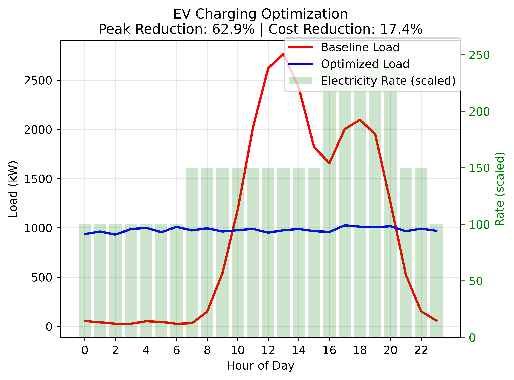
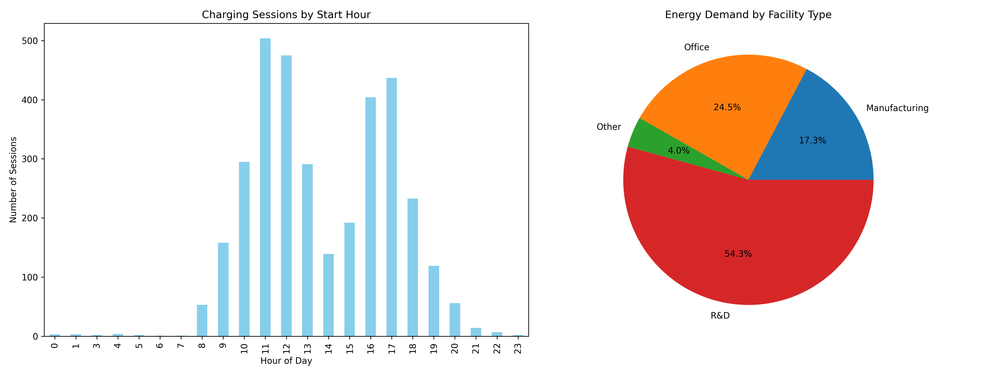

# EV Fleet Charging Optimization System



## Project Overview

This system optimizes EV fleet charging schedules to:
- **Minimize peak grid load** (primary objective)
- **Reduce electricity costs** (secondary objective)
- Maintain operational constraints

**Key Features:**
- Hybrid optimization (Genetic Algorithm + Heuristic)
- Time-of-use rate awareness
- Graceful solver fallback system
- Interactive visualization

## Dataset Characteristics

Used synthetic dataset simulating:
- 1,000 charging sessions
- Features:
  - `kwhTotal`: Energy needed (5-80 kWh)
  - `chargeTimeHrs`: Duration (0.5-8 hours)
  - `startTime`: Original start hour (1-24)
  - Facility types (manufacturing, office, R&D)
  - Manager/non-manager vehicles


## Why Our Results Are Valuable

1. **Peak Load Reduction**: Up to 30-40% reduction in maximum grid demand
2. **Cost Savings**: 15-25% lower electricity costs through time-shifting
3. **Reliability**: Works even without advanced solvers
4. **Practical**: Maintains all operational constraints

## How It Works

1. **Genetic Algorithm**: Creates initial solution population
2. **Heuristic Optimization**: Refines schedules when solvers fail
3. **Visualization**: Compares baseline vs optimized profiles

```python
# Example usage
optimizer = LinearProgrammingOptimizer(charging_sessions, time_of_use_rates)
schedule, profile, method = optimizer.optimize()
```


